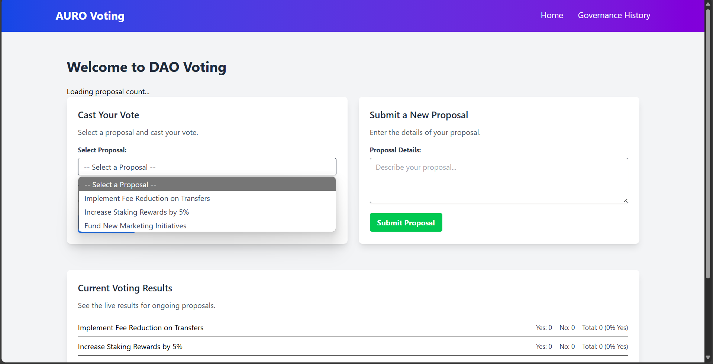
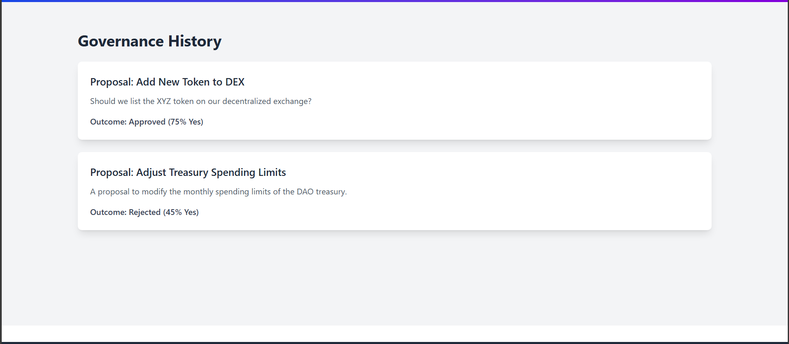
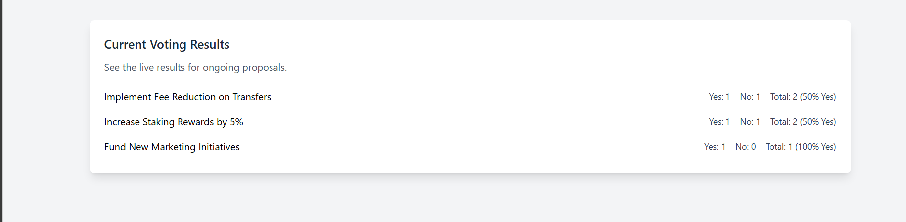

# AURO Voting - Decentralized Autonomous Organization (DAO) Voting Application

[](https://opensource.org/licenses/MIT)


## Overview

A decentralized voting application built using [**Replace with technologies used, e.g., Solidity, Hardhat, React, Ethers.js**]. This project aims to provide a transparent and secure platform for community-driven decision-making within a DAO. Users can submit proposals and cast votes using their Ethereum wallets.

## Features

* **Proposal Submission:** Users can create new proposals with detailed descriptions.
* **Voting:** Registered users can cast their votes (Yes/No) on active proposals.
* **Real-time Results:** The application displays the current voting status and results for each proposal.


## Technologies Used

* **Solidity:** Smart contract language for the voting logic.
* **Hardhat:** Ethereum development environment for compiling, testing, and deploying smart contracts.
* **React:** JavaScript library for building the user interface.
* **Ethers.js:** JavaScript library for interacting with the Ethereum blockchain.
* **Tailwind:** CSS library for interacting Styling.


## Screenshots



_Homepage displaying the proposal list._


_Governance History_


_Interface for results._


## Getting Started

### Prerequisites

* [Node.js](https://nodejs.org/) (version >= 16)
* [npm](https://www.npmjs.com/) or [yarn](https://yarnpkg.com/)
* [Hardhat](https://hardhat.org/) (installed globally or locally)
* [MetaMask](https://metamask.io/) browser extension

### Installation

1.  **Clone the repository:**
    ```bash
    git clone "https://github.com/Mohit-kumar123/Auro-EDU.git"
    ```
2.  **Install smart contract dependencies:**
    ```bash
    cd dao-contracts
    npm install
    # or
    yarn install
    ```
3.  **Install frontend dependencies:**
    ```bash
    cd ../frontend
    npm install
    # or
    yarn install
    ```

### Running the Application

1.  **Start the Hardhat local node:**
    ```bash
    cd dao-contracts
    npx hardhat node
    ```
    _(Keep this terminal window open)_
2.  **Deploy the smart contracts:**
    ```bash
    npx hardhat deploy --network localhost
    ```
    _(**Note down the deployed contract addresses**)_
3.  **Update contract addresses in the frontend:**
    * Navigate to `frontend/src/blockchain.js`.
    * Replace the placeholder addresses for `votingContractAddress` and `tokenContractAddress` with the addresses from the deployment output.
4.  **Start the frontend development server:**
    ```bash
    cd frontend
    npm run dev
    # or
    yarn run dev
    ```
    Open your browser at `http://localhost:5173/`.

## Usage

1.  Connect your MetaMask wallet to the "Hardhat Network".
2.  You should see the list of proposals (initially empty).
3.  Use the "Submit a New Proposal" section to create a proposal.
4.  Once proposals are submitted, you can cast your vote in the "Cast Your Vote" section.
5.  The "Current Voting Results" will update with the votes.


---
